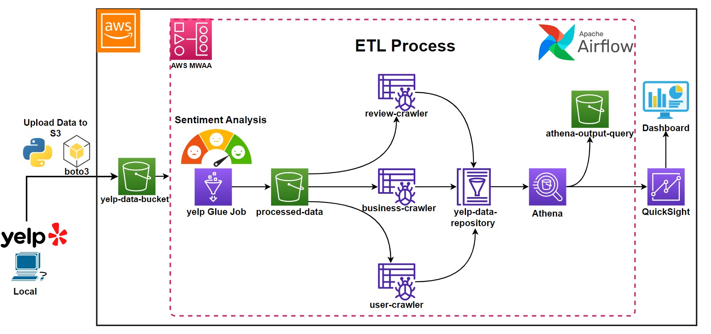

# Simple ETL Orchestration in AWS
This repository contains the necessary code and resources used in the Medium blog post titled ["ETL Orchestration on Yelp Dataset using Glue and AWS MWAA (Airflow)"](https://medium.com/@TugrulGokce/etl-orchestration-on-yelp-dataset-using-glue-and-aws-mwaa-airflow-bcdfc676e46b). It demonstrates how to orchestrate an ETL process using AWS Glue and AWS Managed Workflows for Apache Airflow (MWAA) on a Yelp dataset.

## Repository Contents
* airflow/: Directory containing Airflow DAG and requirements file.
* permissions/: Directory containing AWS Service Role screenshots used in the Medium blog post.

## About The Project

In the era of data-driven decision making, ETL processes play a critical role. This project aims to demonstrate a simple ETL (Extract, Transform, Load) process using the AWS ecosystem. The Yelp dataset is used as an example for this process. AWS Glue is utilized to perform data cataloging and ETL operations, and AWS MWAA is used to orchestrate these tasks in a manageable manner.

## Prerequisites
* AWS account
* Basic understanding of AWS Glue, AWS MWAA (Apache Airflow), and ETL processes
* Yelp dataset, you can find in here [Yelp Dataset](https://www.kaggle.com/datasets/yelp-dataset/yelp-dataset/)

## Setup & Usage
1. Clone this repository to your local machine.
2. Set up your AWS account and configure AWS Glue and AWS MWAA as per the instructions in the Medium blog post.
3. Use the code scripts provided in this repository to define your ETL jobs in AWS Glue and orchestrate them using MWAA.
4. A detailed, step-by-step guide is provided in the [Medium](https://medium.com/@TugrulGokce/etl-orchestration-on-yelp-dataset-using-glue-and-aws-mwaa-airflow-bcdfc676e46b) blog post.

## Contact
If you have any questions, issues or suggestions please feel free to [Email me](mailto:tugrulgkc1@gmail.com)
